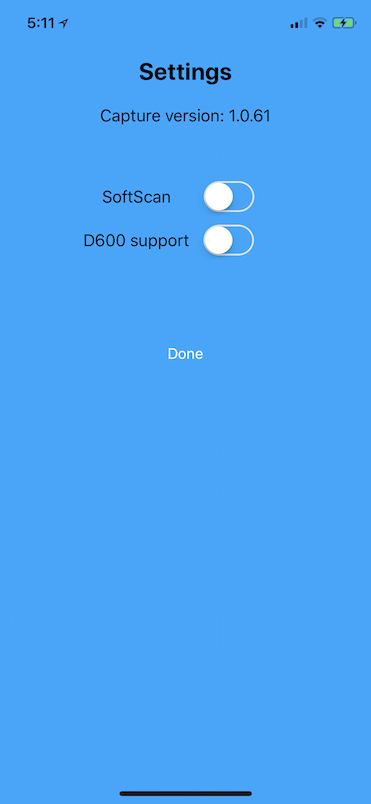

# SingleEntry for iOS
Simple iOS app showing the use of Capture SDK.

## IMPORTANT
When using/installing CocoaPods in a new project, the project workspace file should be used instead of the project file.

The Socket Mobile Bluetooth barcode scanners and RFID Readers use the External Accessory Framework.

It is very important to make sure your application info plist file contains the supported external accessory protocol string array `com.socketmobile.chs`.

The previous version of iOS used to give an error message in the traces when a barcode scanner connects to the iOS device and the protocol string was omitted, but that is no longer the case with the most recent version of iOS.

Adding the external accessory protocol string to your application will require your application to be whitelisted with Socket Mobile before submission to the App Store.

Make sure to contact Socket Mobile in order to whitelist your application.  You can submit your app to be whitelisted in the Socket Mobile Developer portal.

## Prerequisites
The Capture SDK uses CocoaPods. If it needs to be installed, please check the [CocoaPods website](https://cocoapods.org/ "CocoaPods Homepage") for the most current instructions.

The Socket Mobile Capture SDK is required in order to compile this sample.

## Installation
The following steps show how to get and build this project.

Open a Terminal window and clone the project:
`$git clone https://github.com/SocketMobile/capturesingleentry-ios.git && cd capturesingleentry-ios`

Then install Socket Mobile Capture SDK:
`pod install`

Last, open the SingleEntry Xcode workspace file:
`open SingleEntry.xcworkspace`

It is important to load the SingleEntry workspace (NOT PROJECT) in Xcode and compile and run.

Build and run the application on a device in order to test with a Socket Mobile device.

## Connecting a Socket Mobile device
### Socket Mobile Barcode Scanner
In order to connect a Socket Mobile Barcode Scanner, the scanner needs to be configured in Application mode (MFi-SPP) for iOS. Please check Socket Mobile website support section in order to download the documentation and to retrieve this configuration barcode. You can also use the Socket Mobile Companion application from the App store to configure your scanner.

The application mode configuration is persistent in the scanner and can only changed by scanning another configuration mode barcode or by doing a reset to factory default.

Once the scanner is configured in application mode (MFi-SPP) for iOS, the pairing to the iOS device can be done by going to the iOS device Bluetooth settings and selecting the scanner that appears in the list of discovered Bluetooth devices.

The scanner is ready as soon as the pairing is completed. The application using Capture can now use the scanner.

This pairing process is required only once for doing this initial connection. The scanner will reconnect automatically to the last iOS device paired after powering it on.

### Socket Mobile Contactless Read-Writer (D600)
The application settings has a switch to turn on in order to connect to a Socket D600 device.

This device is using Bluetooth Low Energy, and its connection process driven by Capture directly.

Turning on the D600 support in the app will automatically launch a Bluetooth discovery, pair and connect to the D600 that is powered on and in the proximity of the iOS device.

If this is the first time the D600 connects to this iOS device, a pairing alert message is displayed to ask for pairing confirmation.

Once this dialog is acknowledged, the D600 becomes operational and can read a RFID / NFC tag.  

There is a set of Capture API the application can use to customize the connection process.

Check the Capture documentation for further details.

## Documentation
The Socket Mobile Capture SDK documentation can be found  [here](http://docs.socketmobile.com/capture-preview/ios/en/latest/ "Socket Mobile Capture SDK documentation").

## Screenshots

### Main View
The main view shows the connection status, an edit box that receives the decoded data and a setting link to display the settings view.

When a scanner is connected, its friendly name appears in the status.

### Settings View
The settings view displays the Capture version, two switches to turn on or off the SoftScan feature and the D600 support. The done link closes this view to go back to the main view.

## Description
SingleEntry displays a scanner connection status. When a scanner is connected, its friendly name is displayed.
The edit box receives the decoded data from the scanner.

There is a Settings link in the middle of the screen that shows a Settings view.

This view displays the version of Capture with a switch to turn ON or OFF SoftScan and a switch to turn on D600 support.

The D600 is Socket Mobile's contactless RFID and NFC reader-writer product that is using Bluetooth Low Energy (BLE).

The Done link in the Settings view closes the view to go back to the main view.

## Implementation
In this simple example the CaptureHelper is "attached" to the main view
controller.

This main view controller derives from the CaptureHelperDelegate protocol and implements some of the delegate methods.

### Main view controller viewDidLoad
This method creates and initializes a CaptureHelper instance and it opens CaptureHelper.

Once the initialization is done,  Capture notifications can be received which includes but not limited to the device arrival, the device removal and the decoded data notifications.

The application information is required in order to be able to open Capture.
The application information contains the developer ID, the application Bundle ID, prefixed by 'ios:', for the platform on which the app is running, and the application key (AppKey) that is retrieved from Socket Mobile developer portal where the application can be registered.

**NOTE: The application Bundle ID is case sensitive**.

The Capture openWithAppInfo:completionHandler is asynchronous. The result can be read in the block function of this method. In this particular example the SoftScan status is retrieved if the result is successful.

### Good example on how the API works: getting the Capture version
All the Capture APIs are asynchronous, meaning it returns right away to the caller without waiting for the completion of the operation.

Each Capture API accepts a block function as argument that is called to return the result and the eventual data requested.

In the case of getting the version, the block function is called with the result and if the result is successful the version in arguments can be used to get the Capture version.

Note that the Block can be in its own environment context and therefore the application UI should not be updated directly. Please refer to the documentation for more details.

### onDeviceArrival
This CaptureHelperDelegate method is called when a scanner is successfully detected by the host.

The scanner can be SoftScan or any other Socket Mobile scanners or RFID Readers supported by Capture.

In this particular case the connection status is updated with the name of the new device.

If the device is SoftScan then the trigger button is enabled and visible.

### onDeviceRemoval
When a scanner is no longer available (disconnected), this delegate is invoked.

In this particular case, the connection status is updated and if the device is SoftScan then the trigger button is hidden from the interface.

### onDecodedData
The onDecodedData delegate is called each time a scanner has successfully decoded the data.

The code updates the text box with the decoded data received after checking if the result is successful.

## CaptureHelper
CaptureHelper is provided as source code. It provides a set of very basic features like enabling disabling barcode symbologies.

## Adding features in CaptureHelper
If a needed feature is not implemented by CaptureHelper, the recommendation is to create an extension of CaptureHelper and copy paste a feature similar from CaptureHelper to the extended one.

Following this recommendation will prevent you from losing the modifications the next time the CocoaPods is updated.
